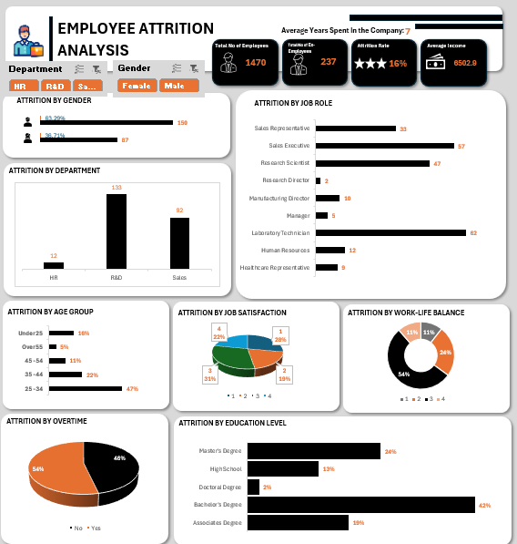

# Employee Attrition Dashboard
The goal is to analyze historical employment data to identify trends and patterns then make recommendations to Management.

# Problem Statement
Out of 1,470 employees, 237 have left - a 16% attrition rate. Attrition isn't evenly spread: R&D accounts for 133 of the 237 exits (56%), nearly 47% of leavers are aged 25–34, and 54% left without working overtime. The company doesn't have a company-wide attrition problem; it has a concentrated retention failure in specific segments, and the current dashboard reports what happened without identifying why.

# Objectives
1. Show where attrition is concentrated (department, role, age, education).
2. Show attrition alongside experience factors (satisfaction, work-life balance, overtime).
3. Give leadership a segmented view of who is leaving, not just how many.

## VISUALIZATION

# Insights with KPIs

- Department: R&D = 133 leavers (56% of all attrition), Sales = 92 (39%), HR = 12 (5%). R&D is the dominant driver of attrition volume.

- Gender: Male employees = 150 leavers (63.3%), Female = 87 (36.7%).

- Job Role: Laboratory Technician has the highest attrition by role (62), followed by Sales Executive (57), Sales Representative (33), Research Scientist (47), Human Resources (12), Manufacturing Director (10), Manager (5), Research Director (2), Healthcare Representative (0).

- Age Group: 25–34 = 47% of attrition, 35–44 = 22%, 45–54 = 11%, Under 25 = 16%, Over 55 = 3%. Attrition is heavily weighted toward early-to-mid career employees (63% under 35).

- Job Satisfaction: Level 3 = 31%, Level 1 = 28%, Level 4 = 22%, Level 2 = 19%. Fairly even spread — no single satisfaction tier dominates leavers.

- Work-Life Balance: Level 3 = 54%, Level 4 = 24%, Level 1 = 11%, Level 2 = 11%. Majority of leavers rated WLB at the higher end (level 3), not the lowest.

- Overtime: No overtime = 54% of leavers, Yes overtime = 46%. Slight majority of leavers were not working overtime.

- Education Level: Bachelor's = 42%, Master's = 24%, Associate's = 19%, High School = 13%, Doctoral = 2%. Bachelor's degree holders dominate attrition.

**Headline KPIs**: 16% attrition rate, 7 years average tenure, ₦8,502.8 average income, 1,470 total headcount, 237 total exits.

# Recommendations

- R&D and the Laboratory Technician role are the two largest concentration points — any retention action targets these first.
- The 25–34 age band is the largest attrition segment — retention focus belongs here over any other age group.
- Satisfaction and WLB scores among leavers skew mid-to-high, not low — dissatisfaction alone doesn't explain the pattern shown.
- Overtime is roughly split (54/46) among leavers — the dashboard doesn't show it as a dominant factor.
- Bachelor's-degree holders and male employees make up the largest shares of attrition by their respective categories.
